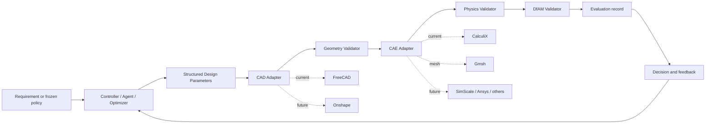

# System Architecture

The architecture is backend-agnostic. FreeCAD, Gmsh, and CalculiX are the first
adapters, not permanent assumptions. Issue #6 composes their existing contracts;
it does not change backend configuration.

## Core Rule

The LLM proposes strict structured design parameters. Deterministic adapters generate CAD, mesh the model, run simulation, validate manufacturability, and compute evaluation records. LLM-generated arbitrary Python CAD code is outside the first-phase core workflow.

Issue #6 exercises the same separation without an LLM. Its
`thickness_descent_v1` controller proposes a frozen sequence, while a structural
evaluator resolves candidate-specific analysis, runs the adapters, checks exact
inclusive constraints, and records provenance. DfAM remains `not_evaluated`, so
this integration slice does not complete the full flow or Gate 3.

## Contracts

- `DesignAgent` proposes parameters from requirements and feedback.
- `Optimizer` proposes parameters without requiring an LLM.
- `CADBackend` converts parameters into deterministic geometry artifacts.
- `GeometryValidator` checks CAD validity before meshing or simulation.
- `CAEBackend` runs deterministic meshing and static FEA.
- `PhysicsValidator` checks stress, displacement, and mass constraints.
- `ManufacturabilityValidator` checks DfAM constraints.
- `Evaluation` combines outcomes into an iteration record.

## Issue #6 closed-loop contracts

- Closed-loop contracts represent trial status, iteration outcomes, structural
  feasibility, stopping reason, best candidate, and provenance failures.
- The controller owns the initial `(8, 50, 18, 2)` parameters, `1 mm` thickness
  descent through `4 mm`, first-structural-failure stopping, and deterministic
  selection by `(mass_g, thickness_mm, iteration_index)`.
- The structural evaluator derives mass from CAD volume using
  `0.00124 g/mm3`, applies `<= 25 MPa` integration-point stress and `<= 2.0 mm`
  displacement limits without rounding, and records `full_benchmark_feasible`
  as `null` until DfAM exists.
- The runner provides single-trial, three-trial experiment, and retained-evidence
  verification modes. Candidate directories isolate tool artifacts and make
  failures auditable.

Backend or provenance errors are terminal run errors even when an earlier best
candidate exists. This prevents partial evidence from being presented as an
accepted run.
