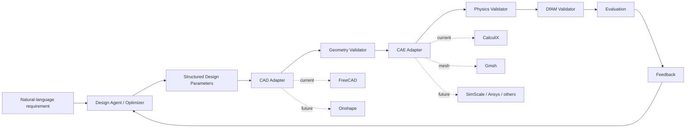

# System Architecture

The architecture is backend-agnostic. FreeCAD and CalculiX are the first adapters, not permanent assumptions.

## Core Rule

The LLM proposes strict structured design parameters. Deterministic adapters generate CAD, mesh the model, run simulation, validate manufacturability, and compute evaluation records. LLM-generated arbitrary Python CAD code is outside the first-phase core workflow.

## Contracts

- `DesignAgent` proposes parameters from requirements and feedback.
- `Optimizer` proposes parameters without requiring an LLM.
- `CADBackend` converts parameters into deterministic geometry artifacts.
- `GeometryValidator` checks CAD validity before meshing or simulation.
- `CAEBackend` runs deterministic meshing and static FEA.
- `PhysicsValidator` checks stress, displacement, and mass constraints.
- `ManufacturabilityValidator` checks DfAM constraints.
- `Evaluation` combines outcomes into an iteration record.
